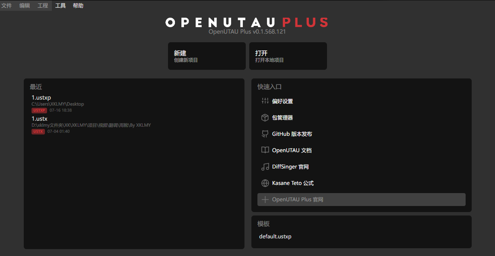
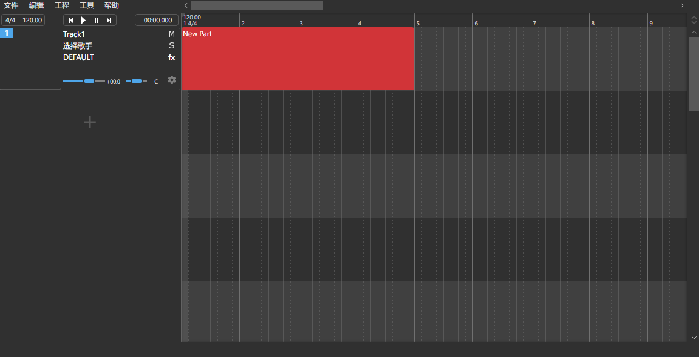
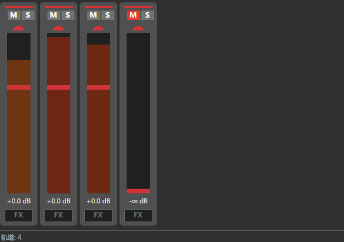
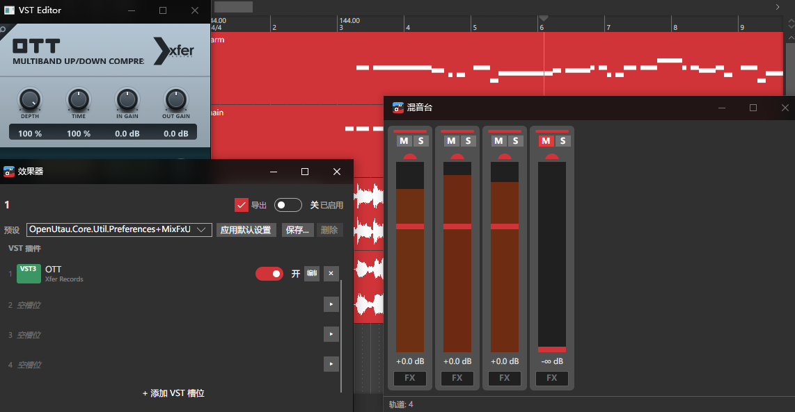
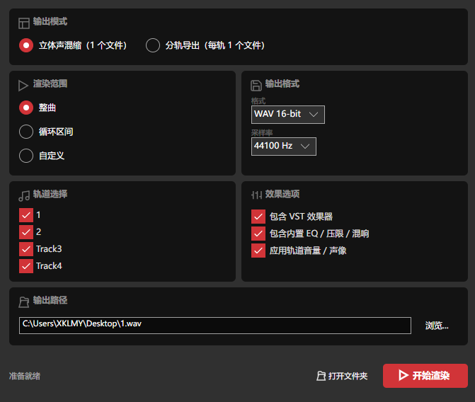

# OpenUTAU Plus

**OpenUTAU** 的增强分支 —— 带 DAW 混音台和 VST3 效果器插件支持的歌声合成工作站。

基于 [OpenUTAU](https://github.com/openutau/OpenUtau) (MIT License)

---

## 新增功能

### 🪟 现代化 UI 升级
- **亚克力/Mica 窗口模糊效果** — 全部窗口统一启用，深浅主题自动切换色调
- **自绘窗口边框** — Edge / Office 风格自定义标题栏，图标 + 标题 + Min/Max/Close 按钮
- **GUI 大改造** — 全局底座现代化、核心控件现代化、细节打磨
- **全面汉化** — 完整中文本地化 + Lucide 图标集成
- **欢迎页重设计** — OpenUTAU Plus 品牌页面

### 🎚️ DAW 风格混音台
- 垂直推子，-24dB ~ +12dB
- 30fps 实时电平表（LevelTracker）
- 静音 / 独奏按钮 + 颜色指示
- 双击数值编辑（音量 / 声像）
- **Ctrl+M** 快捷键开关

### 🔌 VST3 效果器插件支持
- 加载任意 VST3 音频效果器（压缩器、EQ、混响、延迟等）
- **原生 GUI 弹出窗口** — 独立 Win32 窗口嵌入插件界面
- **实时参数同步** — GUI 旋钮变动立即影响音频输出
- **乐器过滤** — 自动排除合成器/采样器等无音频输入的插件
- 每轨道最多 8 个槽位，按顺序串行处理
- 3 个内置效果器：EQ / Compressor / Reverb（基于原版"试听效果"，重构为可折叠面板 + 支持旁通切换）

### 📦 .ustxp 项目格式
- Plus 专属格式，`ustxpVersion: 1.0`
- VST 插件参数持久化 — 重新打开项目自动恢复插件设置
- 向后兼容 `.ustx`
---

## 实机截图

<div align="center">

### 欢迎页


### 主编辑器


### 混音台


### VST 效果器


### 渲染窗口


</div>


---

## 设计目标

OpenUTAU Plus 的愿景是将 OpenUTAU 从歌声合成编辑器逐步扩展为一个 **以人声为中心的 DAW 工作站**，让用户无需离开软件就能完成混音、母带、效果处理等全流程。

### 近期目标（v1.x）

- ✅ 混音台（每轨道推子、声像、静音独奏、电平表）
- ✅ VST3 效果器插件支持（加载、GUI、实时参数）
- ✅ `.ustxp` 项目格式（VST 参数持久化）
- ✅ 导出带 VST 效果的音频（实时录制静音播放）
- 🚧 VST 音源插件支持（加载合成器/采样器作为音源）
- 🚧 macOS / Linux 跨平台支持

### 远期愿景

- 发送轨 / Aux 总线 / 侧链压缩
- 插件延迟补偿（PDC）
- 轨道编组与 VCA 推子
- MIDI 控制面映射
- 内置采样器与鼓机

---

## 快速开始

```bash
git clone https://github.com/XKLMY-hi/OpenUTAU-Plus.git
cd OpenUTAU-Plus
dotnet restore
dotnet run --project OpenUtau
```

需要 [.NET 8.0 Runtime](https://dotnet.microsoft.com/download/dotnet/8.0)。

> **平台支持**：OpenUTAU Plus 本体用 C# / Avalonia 构建，可在 Windows / macOS / Linux 上运行。但 **VST3 桥接 DLL 目前仅编译了 Windows x64**，macOS 和 Linux 下 VST 相关功能暂时不可用。

---

## 局限性与待实现功能

以下限制是设计决策或尚未完成的工作，**请在使用前了解**：

| 限制 | 说明 |
|------|------|
| ~~导出不含 VST 效果~~ **✅ 已解决** | 实时录制模式：通过静音播放全信号链录制，含 VST + 内置 FX + 音量/声像 |
| **不支持 VST 音源** | 不可加载 VST 合成器/采样器（乐器类插件）作为音源。扫描器会自动过滤，仅显示效果器 |
| **仅 Windows x64** | 桥接 DLL 仅编译了 Windows x64。macOS / Linux 用户暂时无法使用 VST 功能 |
| **发送轨 / 侧链** | 尚未实现 Aux 总线和侧链压缩路由 |
| **单线程渲染** | 渲染引擎按轨道顺序串行处理，尚未引入并行化 |

这些都在 [设计目标](#设计目标) 的路线图中规划了解决方案。

---

## 构建 VST 桥接 DLL（可选）

仅修改桥接 C++ 代码时需要：

```bat
cd runtimes\vst_bridge
build.bat
```

需要 **Visual Studio 2022**（Community 版可）的「使用 C++ 的桌面开发」工作负载。

---

## 架构

```
C# (Avalonia UI)                         C++ (VST3 桥接)
━━━━━━━━━━━━━━━━━━━━━━━━━━━━━━━━━━━━━━━━━━━━━━━━━━━━━━━━━━━━━━

VstPluginRegistry  ─── 扫描系统 VST3 目录
       │
VstPluginManager   ─── 每轨道实例管理（UI 加载，音频只读）
       │
VstEffect : IEffect ─── 插入 EffectChain
       │                    │
       │ [P/Invoke]         │ EffectChain.Mix()
       ▼                    ▼
  VstBridge.cs          fx.Process(scratch)
       │
       ▼ [DllImport]
  vst_bridge.dll (Steinberg VST3 SDK v3.8.0)
       │
       ├─ IComponent / IAudioProcessor ── 音频处理
       ├─ IEditController / createView ── 原生 GUI
       └─ performEdit → 原子队列 → inputParameterChanges
```

### 参数流

```
Plugin GUI 旋钮
  → Controller::setParamNormalized()
    → BridgeCompHandler::performEdit()
      → 原子环形队列（无锁，SPSC）
        → vst_process() 消费
          → ProcessData::inputParameterChanges
            → IAudioProcessor::process() → 音频实时变化 ✅
```

---

## 项目结构

```
OpenUtau.sln
├── OpenUtau/               # 主应用 UI（Avalonia）
│   ├── Views/              # MainWindow、MixerWindow、VstEditorWindow 等
│   ├── ViewModels/         # MVVM
│   └── Controls/           # MixerTrackStrip 等自定义控件
├── OpenUtau.Core/          # 核心逻辑
│   ├── Ustx/               # 数据模型
│   ├── Render/             # 渲染引擎
│   ├── SignalChain/        # 信号链（EffectChain、LevelTracker、Fader）
│   └── Vst/                # VST 宿主（VstEffect、VstBridge、VstPluginManager）
├── OpenUtau.Plugin.Builtin/
├── OpenUtau.Test/
├── runtimes/               # 原生平台库
│   ├── vst_bridge/         # C++ 桥接项目（CMake）
│   └── win-x64/native/     # vst_bridge.dll + worldline.dll
└── VstTest/                # VST 功能独立测试
```

---

## 开发

```bash
dotnet build                                  # 构建全部
dotnet run --project OpenUtau                 # 运行
dotnet test                                   # 单元测试
dotnet run --project VstTest                  # VST 兼容性测试
```

详见 [CLAUDE.md](./CLAUDE.md) 了解完整架构和开发指南。

---

## 技术栈

| 层 | 技术 |
|----|------|
| 运行时 | .NET 8.0 / C# 12 |
| UI 框架 | Avalonia 11.x + ReactiveUI MVVM |
| 音频播放 | NAudio (WASAPI) / MiniAudio |
| 音频 DSP | NWaves |
| 信号链 | 自定义 ISignalSource / IEffect 接口 |
| VST3 宿主 | C++ / Steinberg VST3 SDK v3.8.0 |
| AI 推理 | ONNX Runtime (DirectML GPU 加速) |
| 图标 | Lucide Icons |
| 序列化 | YamlDotNet / Newtonsoft.Json |
| 日志 | Serilog |
| 测试 | xUnit |

---

## 使用的开源库

本项目的构建离不开以下开源项目，在此致谢。

### 核心

| 库 | 版本 | 许可 | 用途 |
|----|------|------|------|
| [Avalonia UI](https://avaloniaui.net/) | 11.2.4 | MIT | 跨平台 UI 框架 |
| [ReactiveUI](https://www.reactiveui.net/) | 19.5 | MIT | MVVM 响应式框架 |
| [NAudio](https://github.com/naudio/NAudio) | 2.2.1 | MIT | Windows 音频播放与处理 |
| [NWaves](https://github.com/ar1st0crat/NWaves) | 0.9.6 | MIT | 音频信号处理 / DSP |
| [ONNX Runtime](https://onnxruntime.ai/) | 1.23 | MIT | 机器学习推理引擎 |
| [YamlDotNet](https://github.com/aaubry/YamlDotNet) | 15.1 | MIT | USTX 项目文件序列化 |
| [Newtonsoft.Json](https://www.newtonsoft.com/json) | 13.0 | MIT | JSON 序列化 |
| [Serilog](https://serilog.net/) | 4.1 | Apache-2.0 | 结构化日志 |

### 音频格式

| 库 | 版本 | 许可 | 用途 |
|----|------|------|------|
| [NAudio.Vorbis](https://github.com/naudio/Vorbis) | 1.5.0 | MIT | Ogg Vorbis 解码 |
| [BunLabs.NAudio.Flac](https://github.com/BunLabs/NAudio.Flac) | 2.0.1 | MIT | FLAC 解码 |
| [NLayer](https://github.com/naudio/NLayer) | 1.4.0 | MIT | MP3 解码 |
| [Concentus.OggFile](https://github.com/lostromb/concentus) | 1.0.6 | Apache-2.0 | Opus 编码 |

### UI / 设计

| 库 | 版本 | 许可 | 用途 |
|----|------|------|------|
| [Material.Avalonia](https://github.com/AvaloniaCommunity/Material.Avalonia) | 3.13.3 | MIT | Material Design 控件 |
| [Lucide Icons](https://lucide.dev/) | — | ISC | 界面图标 |
| [Dotnet.Bundle](https://github.com/egramtel/dotnet-bundle) | 0.9.13 | MIT | macOS 应用打包 |

### 文件格式 / MIDI

| 库 | 版本 | 许可 | 用途 |
|----|------|------|------|
| [DryWetMidi](https://github.com/melanchall/drywetmidi) | 7.2.0 | MIT | MIDI 文件读写 |
| [SharpCompress](https://github.com/adamhathcock/sharpcompress) | 0.48.1 | MIT | 压缩包解压 |

### 语言 / 音素处理

| 库 | 版本 | 许可 | 用途 |
|----|------|------|------|
| [csharp-pinyin](https://github.com/poychang/csharp-pinyin) | 1.0.0 | MIT | 汉字转拼音 |
| [csharp-kana](https://github.com/poychang/csharp-kana) | 1.0.2 | MIT | 假名转换 |
| [WanaKana-net](https://github.com/MartinZikmund/WanaKana-net) | 1.0.0 | MIT | 日文假名处理 |
| [UTF.Unknown](https://github.com/CharsetDetector/UTF-unknown) | 2.5.1 | MIT | 文本编码检测 |

### 工具

| 库 | 版本 | 许可 | 用途 |
|----|------|------|------|
| [TextCopy](https://github.com/CopyText/TextCopy) | 6.2.1 | MIT | 跨平台剪贴板 |
| [K4os.Hash.xxHash](https://github.com/k4os/K4os.Hash.xxHash) | 1.0.8 | MIT | 高速哈希 |
| [Ignore](https://github.com/nicoco007/Ignore) | 0.1.50 | MIT | .gitignore 规则解析 |
| [NumSharp](https://github.com/SciSharp/NumSharp) | 0.30.0 | Apache-2.0 | 数值计算 |
| [NeoLua](https://github.com/neolithos/NeoLua) | 1.3.19 | Apache-2.0 | Lua 脚本引擎 |
| [NetMQ](https://github.com/zeromq/netmq) | 4.0.1 | LGPL-3.0 | 进程间通信 |

### C++ 原生 (VST3 桥接)

| 库 | 版本 | 许可 | 用途 |
|----|------|------|------|
| [VST3 SDK](https://github.com/steinbergmedia/vst3sdk) | 3.8.0 | MIT / GPL-3 | VST3 宿主桥接 |
| [Worldline](https://github.com/stakira/OpenUtau) | — | MIT | 原生音频渲染引擎 |

### 设计资源

| 资源 | 许可 | 来源 |
|------|------|------|
| Lucide Icons | ISC | https://lucide.dev/ |

---

## 许可证

基于 [OpenUTAU](https://github.com/openutau/OpenUtau)，MIT License。

VST3 桥接基于 [Steinberg VST3 SDK v3.8.0](https://github.com/steinbergmedia/vst3sdk)，MIT / GPL-3 双许可（本项目使用 MIT 许可部分）。

Lucide 图标使用 ISC License。

---

## 致谢

- [OpenUTAU](https://github.com/openutau/OpenUtau) 原版项目及全体贡献者
- Steinberg 提供 VST3 SDK
- 歌声合成社区
- 本项目以 **Vibe Coding** 方式开发 —— 使用 DeepSeek V4 Pro AI 辅助编程完成架构设计、代码生成与调试
