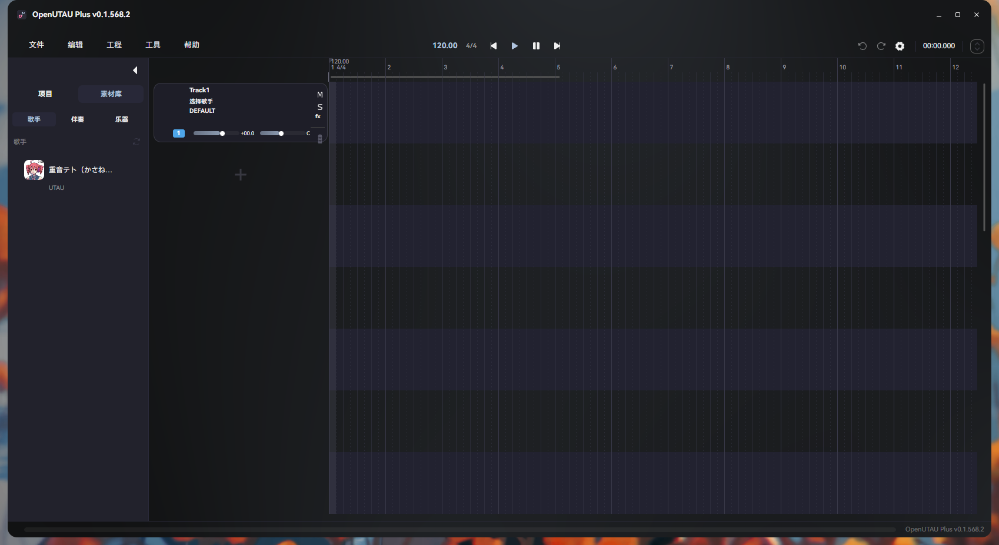
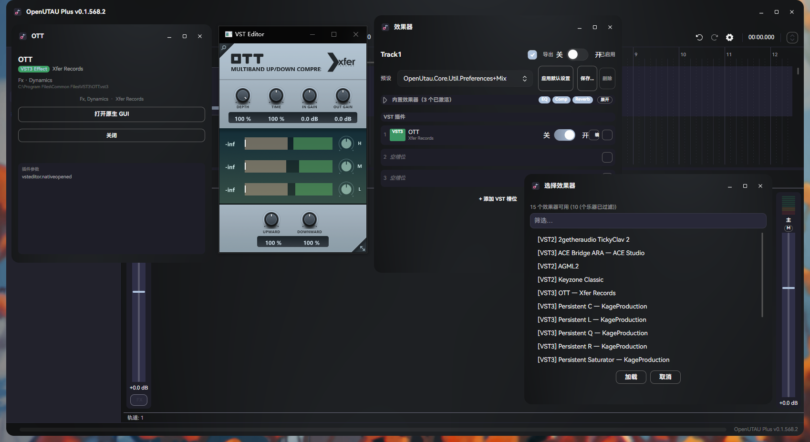

# OpenUTAU Plus

**OpenUTAU** 的增强分支 —— 带 DAW 混音台、VST3 效果器插件和侧栏素材库的歌声合成工作站。

基于 [OpenUTAU](https://github.com/openutau/OpenUtau) (MIT License)

---

## 界面预览

| 欢迎页 | 主窗口 + 侧栏素材库 |
|---|---|
|  |  |

| 混音台 + VST 效果器架 |
|---|
|  |

---

## 新增功能

### 🪟 现代化 UI 全面翻新
- **暖灰暗色主题** — 自定义色板（底色 `#1e1e28` · 表面 `#282838` · 强调色 `#c73a3f`），替换 FluentTheme 默认深色
- **亚克力 / Mica 窗口模糊** — 全部窗口统一启用，右键设置中切换模糊类型或关闭；Tint 65% 深冷灰
- **自绘窗口边框** — 按 Avalonia 12 官方 **WindowDrawnDecorations** 规范统一实现（1px 描边 + 阴影分层，图标 + 标题 + Min/Max/Close 标题栏），全部 30+ 窗口统一
- **HarmonyOS Sans SC 字体** — 四字重（Light/Regular/Medium/Bold），全局应用
- **Phosphor 图标** — 54 枚 MIT 许可饱满圆润实心矢量图标（HarmonyOS 风），替换 Lucide
- **8px 统一圆角** — 按钮 / 文本框 / 卡片 / 弹出层全局 8px 圆角 · 32px 控件高度
- **左右分栏欢迎页** — 最近项目列表 + 快捷操作卡片 + 模板文件，移除旧版侧栏切换
- **Card 分组偏好设置** — 纯文本窄导航 + 右区独立圆角卡片，胶囊形开关，细边镶嵌下拉菜单
- **混音台 / VST / 插件槽暖灰统一** — 推子 accent 色、面板底色、8px 圆角
- **全面汉化** — 完整中文本地化

### 🎚️ DAW 风格混音台
- 垂直推子，-24dB ~ +12dB
- 30fps 实时电平表（LevelTracker，采样**实际输出**——推子/效果链之后）
- 静音 / 独奏按钮 + 颜色指示
- 双击数值编辑（音量 / 声像）
- **FL Studio 式声像旋钮** — 左右半区侧向拖动（实时切换检测）、全局鼠标追踪
- **10 段 LED 电平表**（绿 6 / 黄 2 / 红 2）、56px 窄条轨道条 + 主推子条
- 新建轨道自动映射混音台、混音台内可新建轨道
- **Ctrl+M** 内嵌在主窗口 / 分离为独立窗口双模式

### 🗂️ 侧栏素材库
- 歌手库 — 圆角头像卡片、歌姬类型徽标、双击/拖拽新建轨道
- 伴奏库 — 格式徽标、独立试听通道（不打断工程播放，可随时终止）
- 自定义拖拽格式，从侧栏直接拖入编辑器

### 🎨 SukiUI 主题框架
- 主题/菜单/浮层由 SukiUI 接管（渐进迁移中）
- 紧凑顶栏菜单、玻璃浮层对话框（半透明 + BlurEffect）
- 自绘标题栏显示应用图标（深底 + 主题蓝音符 + 粉唱片环，方案 B 定稿）

### 🔌 VST3 效果器插件支持
- 加载任意 VST3 音频效果器（压缩器、EQ、混响、延迟等）
- **原生 GUI 弹出窗口** — 独立 Win32 窗口嵌入插件界面
- **实时参数同步** — GUI 旋钮变动立即影响音频输出
- **乐器过滤** — 自动排除合成器/采样器等无音频输入的插件
- 每轨道最多 8 个槽位，按顺序串行处理
- 3 个内置效果器：EQ / Compressor / Reverb（基于原版"试听效果"，重构为可折叠面板 + 支持旁通切换）

### 📦 .ustxp 项目格式
- Plus 专属格式，`ustxpVersion: 1.0`
- VST 插件参数持久化 — 重新打开项目自动恢复插件设置
- 向后兼容 `.ustx`
---

## 2026-08 框架升级：Avalonia 12

- **UI 框架升级至 Avalonia 12.1.0**（原 11.2.4）— 渲染架构重写（复杂界面 FPS 大幅提升）、Skia 3.0 渲染管线、Compiled bindings、官方自绘窗口装饰规范
- **自绘边框重写** — 按 Avalonia 12 官方 **WindowDrawnDecorations** 规范统一实现（替代 11 时代手搓标题栏）：全窗口 1px 描边 + 阴影分层，最大化自动去边框，标题栏拖拽 / 三按钮 / 全屏悬停栏由官方机制接管
- **依赖迁移** — `Avalonia.ReactiveUI` → `ReactiveUI.Avalonia`（Rx 兼容线，全部 ViewModel 零改动）、xunit v2 → v3、新增 HarfBuzz 文本整形
- 为后续引入 UI 组件库（SukiUI 已落地）铺平道路

## 2026-08 音频管线重构

一次全面的音频管线重构（四阶段、~20 个原子提交），核心成果：

### 🔒 VST 宿主安全加固
- **B1 竞态修复**（use-after-free 崩溃）— 引入回调 drain 屏障（`CallbackTrackedSampleProvider`）+ 渲染在飞计数（`RenderGate`），VST 延迟销毁（Flush）收敛到输出停止 + 回调退出之后的确定安全点
- **VST3 单文件探测进程外化** — 插件 DLL 崩溃只杀死探针子进程，不再带崩主程序（vst_probe.exe `--vst3` 通道）
- **异步加载** — 原生插件 Load/Setup/State 还原移出 UI 线程（慢插件加载不再卡界面）

### ⚡ 异步渲染 + seek 秒开
- **内存短语缓存**（`PhraseRenderCache`，LRU 256MB）— seek / 循环播放命中缓存秒开，只渲染新暴露的短语；编辑音符自动失效
- **短语级并行渲染**（DOP = 渲染线程数配置，默认 2）— 不再逐短语串行等待
- **两批播放策略** — 播放头前方短语渲染完成即开始播放，后方短语后台继续（既有静音兜底），消除 seek 卡顿根因

### 📦 导出统一 + 可撤销
- 三条导出路径（菜单整曲 / 菜单分轨 / 渲染窗口）统一为 **ExportSession** — 一致立体声 16-bit、共用渲染与写文件路径、进度/取消统一
- **VST 槽位操作全部命令化** — 添加/移除/替换/旁路可 Ctrl+Z 撤销，undo 恢复实例并还原插件参数

### 📐 格式显式化
- `AudioSettings` 成为全局音频格式事实来源，信号链/输出/播放/导出层 20+ 处 44100/2ch 硬编码清零（`ISignalSource` 默认接口成员承载格式）
- 为未来采样率可配置铺路（`AudioSettings.Configure` 已就绪）

---

## 设计目标

OpenUTAU Plus 的愿景是将 OpenUTAU 从歌声合成编辑器逐步扩展为一个 **以人声为中心的 DAW 工作站**，让用户无需离开软件就能完成混音、母带、效果处理等全流程。

### 近期目标（v1.x）

- ✅ 混音台（每轨道推子、声像、静音独奏、电平表）+ 内嵌/分离双模式 + DAW 化（FL 式旋钮 / LED 电平表）
- ✅ VST3 效果器插件支持（加载、GUI、实时参数、槽位操作可撤销）
- ✅ `.ustxp` 项目格式（VST 参数持久化）
- ✅ 导出带 VST 效果的音频（离线渲染，三路径统一）
- ✅ 音频管线重构（B1 竞态修复 · VST3 进程外探测 · 异步渲染 + seek 秒开 · 格式显式化）
- ✅ 现代化 UI 全面翻新（自定义暖灰主题 · 亚克力模糊 · 自绘边框 · Phosphor · HarmonyOS Sans SC · 8px 统一圆角 · SukiUI）
- ✅ 侧栏素材库（歌手库 + 伴奏库，拖拽建轨 / 独立试听）
- 🚧 VST 音源插件支持（加载合成器/采样器作为音源）
- 🚧 macOS / Linux 跨平台支持

### 远期愿景

- 发送轨 / Aux 总线 / 侧链压缩
- 插件延迟补偿（PDC）
- 轨道编组与 VCA 推子
- MIDI 控制面映射
- 内置采样器与鼓机

---

## 快速开始

```bash
git clone https://github.com/XKLMY-hi/OpenUTAU-Plus.git
cd OpenUTAU-Plus
dotnet restore
dotnet run --project OpenUtau
```

需要 [.NET 8.0 Runtime](https://dotnet.microsoft.com/download/dotnet/8.0)。

> **平台支持**：OpenUTAU Plus 本体用 C# / Avalonia 构建，可在 Windows / macOS / Linux 上运行。但 **VST3 桥接 DLL 目前仅编译了 Windows x64**，macOS 和 Linux 下 VST 相关功能暂时不可用。

---

## 局限性与待实现功能

以下限制是设计决策或尚未完成的工作，**请在使用前了解**：

| 限制 | 说明 |
|------|------|
| ~~导出不含 VST 效果~~ **✅ 已解决** | 离线渲染导出（ExportSession）：与播放同路径全信号链，含 VST + 内置 FX + 音量/声像 |
| ~~单线程渲染~~ **✅ 已解决** | 短语级并行渲染（DOP 可配，默认 2）+ 播放头优先两批策略 + 内存短语缓存（seek 秒开） |
| **不支持 VST 音源** | 不可加载 VST 合成器/采样器（乐器类插件）作为音源。扫描器会自动过滤，仅显示效果器 |
| **仅 Windows x64** | 桥接 DLL 仅编译了 Windows x64。macOS / Linux 用户暂时无法使用 VST 功能 |
| **发送轨 / 侧链** | 尚未实现 Aux 总线和侧链压缩路由 |

这些都在 [设计目标](#设计目标) 的路线图中规划了解决方案。

---

## 构建 VST 桥接 DLL（可选）

仅修改桥接 C++ 代码时需要：

```bat
cd runtimes\vst_bridge
build.bat
```

需要 **Visual Studio 2022**（Community 版可）的「使用 C++ 的桌面开发」工作负载。

---

## 架构

```
C# (Avalonia UI)                         C++ (VST3 桥接)
━━━━━━━━━━━━━━━━━━━━━━━━━━━━━━━━━━━━━━━━━━━━━━━━━━━━━━━━━━━━━━

VstPluginRegistry  ─── 扫描系统 VST3 目录
       │  ├─ bundle: 读 moduleinfo.json（进程内）
       │  └─ 单文件: vst_probe.exe 子进程探测（崩溃隔离）
       │
VstPluginManager   ─── 每轨道实例管理（UI 异步加载，音频只读快照）
       │                 └─ 延迟销毁经 RenderGate 在飞计数 + 输出 drain 屏障
VstEffect : IEffect ─── 插入 EffectChain
       │                    │
       │ [P/Invoke]         │ EffectChain.Mix()
       ▼                    ▼
  VstBridge.cs          fx.Process(scratch)
       │
       ▼ [DllImport]
  vst_bridge.dll (Steinberg VST3 SDK v3.8.0)
       │
       ├─ IComponent / IAudioProcessor ── 音频处理
       ├─ IEditController / createView ── 原生 GUI
       └─ performEdit → 原子队列 → inputParameterChanges
```

### 参数流

```
Plugin GUI 旋钮
  → Controller::setParamNormalized()
    → BridgeCompHandler::performEdit()
      → 原子环形队列（无锁，SPSC）
        → vst_process() 消费
          → ProcessData::inputParameterChanges
            → IAudioProcessor::process() → 音频实时变化 ✅
```

---

## 项目结构

```
OpenUtau.sln
├── OpenUtau/               # 主应用 UI（Avalonia）
│   ├── Views/              # MainWindow、MixerWindow、VstEditorWindow、TrackEffectRack 等
│   ├── ViewModels/         # MVVM
│   ├── Controls/           # MixerTrackStrip、PanKnob、MasterStrip 等自定义控件
│   └── Styles/             # SukiUI 收敛层 / 紧凑菜单
├── OpenUtau.Core/          # 核心逻辑
│   ├── Ustx/               # 数据模型
│   ├── Render/             # 渲染引擎（RenderEngine、PhraseRenderCache、RenderCache）
│   ├── SignalChain/        # 信号链（EffectChain、LevelTracker、Fader、MasterAdapter）
│   ├── Export/             # 统一导出会话（ExportSession）
│   ├── Audio/              # 输出层（IAudioOutput、CallbackTrackedSampleProvider）
│   ├── Commands/           # 可撤销命令（TrackMixCommands 含 VST 槽位）
│   └── Vst/                # VST 宿主（VstEffect、VstBridge、VstPluginManager、RenderGate、VstProbeProcess）
├── OpenUtau.Plugin.Builtin/
├── OpenUtau.Test/
├── VstProbe/               # 进程外探测子程序（vst_probe.exe）
├── runtimes/               # 原生平台库
│   ├── vst_bridge/         # C++ 桥接项目（CMake）
│   └── win-x64/native/     # vst_bridge.dll + worldline.dll
└── VstTest/                # VST 功能独立测试
```

---

## 开发

```bash
dotnet build                                  # 构建全部
dotnet run --project OpenUtau                 # 运行
dotnet test                                   # 单元测试
dotnet run --project VstTest                  # VST 兼容性测试
```

详见 [CLAUDE.md](./CLAUDE.md) 了解完整架构和开发指南。

---

## 技术栈

| 层 | 技术 |
|----|------|
| 运行时 | .NET 8.0 / C# 12 |
| UI 框架 | Avalonia 12.1.0 + SukiUI 7.0.2-nightly + ReactiveUI.Avalonia 14.7.1 |
| 音频播放 | NAudio (WASAPI) / MiniAudio |
| 音频 DSP | NWaves |
| 信号链 | 自定义 ISignalSource / IEffect 接口（格式由 AudioSettings 统一） |
| VST3 宿主 | C++ / Steinberg VST3 SDK v3.8.0（进程外探测 vst_probe.exe） |
| AI 推理 | ONNX Runtime (DirectML GPU 加速) |
| 图标 | Phosphor |
| 序列化 | YamlDotNet / Newtonsoft.Json |
| 日志 | Serilog |
| 测试 | xUnit v3 |

---

## 使用的开源库

本项目的构建离不开以下开源项目，在此致谢。

### 核心

| 库 | 版本 | 许可 | 用途 |
|----|------|------|------|
| [Avalonia UI](https://avaloniaui.net/) | 12.1.0 | MIT | 跨平台 UI 框架 |
| [SukiUI](https://github.com/kikipoulet/SukiUI) | 7.0.2-nightly | MIT | 主题 + 控件库 |
| [ReactiveUI.Avalonia](https://github.com/reactiveui/ReactiveUI) | 14.7.1 | MIT | MVVM 响应式框架（Avalonia 12 兼容线） |
| [NAudio](https://github.com/naudio/NAudio) | 2.2.1 | MIT | Windows 音频播放与处理 |
| [NWaves](https://github.com/ar1st0crat/NWaves) | 0.9.6 | MIT | 音频信号处理 / DSP |
| [ONNX Runtime](https://onnxruntime.ai/) | 1.23 | MIT | 机器学习推理引擎 |
| [YamlDotNet](https://github.com/aaubry/YamlDotNet) | 15.1 | MIT | USTX 项目文件序列化 |
| [Newtonsoft.Json](https://www.newtonsoft.com/json) | 13.0 | MIT | JSON 序列化 |
| [Serilog](https://serilog.net/) | 4.1 | Apache-2.0 | 结构化日志 |

### 音频格式

| 库 | 版本 | 许可 | 用途 |
|----|------|------|------|
| [NAudio.Vorbis](https://github.com/naudio/Vorbis) | 1.5.0 | MIT | Ogg Vorbis 解码 |
| [BunLabs.NAudio.Flac](https://github.com/BunLabs/NAudio.Flac) | 2.0.1 | MIT | FLAC 解码 |
| [NLayer](https://github.com/naudio/NLayer) | 1.4.0 | MIT | MP3 解码 |
| [Concentus.OggFile](https://github.com/lostromb/concentus) | 1.0.6 | Apache-2.0 | Opus 编码 |

### UI / 设计

| 库 | 版本 | 许可 | 用途 |
|----|------|------|------|
| [HarmonyOS Sans SC](https://developer.harmonyos.com/) | — | OFL | 全局 UI 字体 |
| [Phosphor](https://phosphoricons.com) | — | MIT | 界面图标 |
| [Dotnet.Bundle](https://github.com/egramtel/dotnet-bundle) | 0.9.13 | MIT | macOS 应用打包 |

### 文件格式 / MIDI

| 库 | 版本 | 许可 | 用途 |
|----|------|------|------|
| [DryWetMidi](https://github.com/melanchall/drywetmidi) | 7.2.0 | MIT | MIDI 文件读写 |
| [SharpCompress](https://github.com/adamhathcock/sharpcompress) | 0.48.1 | MIT | 压缩包解压 |

### 语言 / 音素处理

| 库 | 版本 | 许可 | 用途 |
|----|------|------|------|
| [csharp-pinyin](https://github.com/poychang/csharp-pinyin) | 1.0.0 | MIT | 汉字转拼音 |
| [csharp-kana](https://github.com/poychang/csharp-kana) | 1.0.2 | MIT | 假名转换 |
| [WanaKana-net](https://github.com/MartinZikmund/WanaKana-net) | 1.0.0 | MIT | 日文假名处理 |
| [UTF.Unknown](https://github.com/CharsetDetector/UTF-unknown) | 2.5.1 | MIT | 文本编码检测 |

### 工具

| 库 | 版本 | 许可 | 用途 |
|----|------|------|------|
| [TextCopy](https://github.com/CopyText/TextCopy) | 6.2.1 | MIT | 跨平台剪贴板 |
| [K4os.Hash.xxHash](https://github.com/k4os/K4os.Hash.xxHash) | 1.0.8 | MIT | 高速哈希 |
| [Ignore](https://github.com/nicoco007/Ignore) | 0.1.50 | MIT | .gitignore 规则解析 |
| [NumSharp](https://github.com/SciSharp/NumSharp) | 0.30.0 | Apache-2.0 | 数值计算 |
| [NeoLua](https://github.com/neolithos/NeoLua) | 1.3.19 | Apache-2.0 | Lua 脚本引擎 |
| [NetMQ](https://github.com/zeromq/netmq) | 4.0.1 | LGPL-3.0 | 进程间通信 |

### C++ 原生 (VST3 桥接)

| 库 | 版本 | 许可 | 用途 |
|----|------|------|------|
| [VST3 SDK](https://github.com/steinbergmedia/vst3sdk) | 3.8.0 | MIT / GPL-3 | VST3 宿主桥接 |
| [Worldline](https://github.com/stakira/OpenUtau) | — | MIT | 原生音频渲染引擎 |

### 设计资源

| 资源 | 许可 | 来源 |
|------|------|------|
| Phosphor | MIT | https://phosphoricons.com |
| HarmonyOS Sans SC | OFL | https://developer.harmonyos.com/ |

---

## 许可证

基于 [OpenUTAU](https://github.com/openutau/OpenUtau)，MIT License。

VST3 桥接基于 [Steinberg VST3 SDK v3.8.0](https://github.com/steinbergmedia/vst3sdk)，MIT / GPL-3 双许可（本项目使用 MIT 许可部分）。

Phosphor 图标使用 MIT License。

---

## 致谢

- [OpenUTAU](https://github.com/openutau/OpenUtau) 原版项目及全体贡献者
- Steinberg 提供 VST3 SDK
- 歌声合成社区
- 本项目以 **Vibe Coding** 方式开发 —— 使用 DeepSeek V4 Pro AI 辅助编程完成架构设计、代码生成与调试
